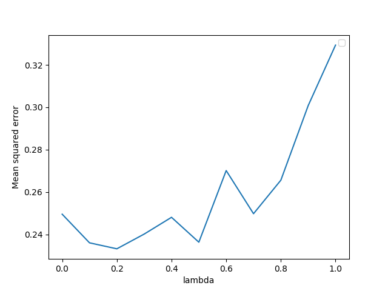

# Easy21

This project is mainly about applying, on one hand, a Monte Carlo Control on the game Easy21 and on the other hand applying Sarsa Lambda on the game Easy21

# Introduction

## Easy21
The game Easy21 is built around the famous casino game [Blackjack](https://en.wikipedia.org/wiki/Blackjack) with a slighty different set of rules.
The different rules are:
* The game is played with an infinite deck of cards

* There are no aces or picture (face) cards in this game
  - Each draw from the deck results in a value between 1 and 10 (uniformly distributed)
  
* The cards do have collors
  - Black (probability 2/3)
  - Red (probability 1/3)
  
* At the start of the game both the player and the dealer draw one black
card (fully observed)

* The values of the player’s cards are added (black cards) or subtracted (red cards)

* It counts for both the player and the dealer that if they get a sum lower then 1 or higher then 21 they go bust and lose.

## Policies
The **player** uses an ε-greedy policy. Meaning she choses a random action with a probability related to ε, otherwise the best action.

The **dealer** plays with a policy where he always sticks on any sum of 17 or greater, and hits otherwise.

## Actions
We can derive from the **Policies** section that there are 2 actions

* HIT: Draw a card
* STAND: Finish your turn. Not drawing more cards.

## Reward
There are three outcomes to this game.
- The player wins if the dealer goes bust or the player has a higher sum (reward +1).
- The player loses if she goes bust or the dealer has a higher sum (reward -1).
- The player draws if she has the same sum as the dealer, or they both go bust (reward 0)

# Implementation

## Monte Carlo Control
### Applying Monte-Carlo control to Easy21.
I initialized the value function to zero and used a time-varying scalar step-size of αt = 1/N(st,at). We use the policy described above for the player (ε-greedy) with εt = N0/(N0 + N(st), where N0 = 1000 is a constant. N(s) is the number of times that state s has been visited, and N(s,a) is the number of times that action a has been selected from state s.

### Applying TD learning control to Easy21.
I implemented Sarsa(λ) for Easy21. The pseudocode can be found [here](https://towardsdatascience.com/introduction-to-various-reinforcement-learning-algorithms-i-q-learning-sarsa-dqn-ddpg-72a5e0cb6287). For this implementation I used the same step-size and exploration schedules as in the Monte-Carlo control implementation. I ran the algorithm with
λ ∈ {0, 0.1, 0.2, . . . , 1} for 1000 episodes each and reported the mean squared error comparing the true values Q∗(s,a) computed in the Monte Carlo implementation with the estimated values Q(s, a) computed by Sarsa at the end, as well as adding an option of receiving a report for the mean squared error for each episode during the run.

# Results and Interpretation
I ran the [Monte Carlo implementation](#monte-carlo-control) algorithm for 500.000 episodes and plotted the true value function V∗(s) = maxa Q∗(s, a) on a heatmap as well as a 3d wireframe representation.

Heatmap                      |   3D 
:---------------------------:|:----------------------------:
  |  

For comparison we can have a look at the true value function for the game Blackjack from Sutton and Barto's book [Reinforcement Learning: An introduction](https://drive.google.com/file/d/1opPSz5AZ_kVa1uWOdOiveNiBFiEOHjkG/view) (You can find it on page *94*). I also plotted it on a heatmap.

As a reminder, we do not have aces in our implementation... Either way we can see similarity when the player has a sum of 20 or 21 the value function has a value close to 1 meaning we can expect the player to win the game.

But I noticed something interesting. For a player sum between 1 and 10 the plots show that the value of the Easy21 value function changes only when the dealers' first card changes. So for a given dealers' first card, the value function gives the same value for a player sum between 1 and 10 (approximately 🤓). This gives me the idea that the player has learned how the dealer behaves and starts taking the standing action and hope the dealer goes bust, because to be honest, the dealer policy is not very great. This is only one idea that came to me! You could prove me wrong by plotting the optimal policy and sending me a pull request otherwise it is on my TODO list 😄. I added an option in the [Easy21](Easy21.py) code to make the dealer policy better, in the code now you can see that it is only commented out. That would explain why the value function is rather high where the dealer has a small number as a first card, as he is then more likely to go bust by getting his sum bellow 1 and if the player stands on a low sum, like for example 8, the dealer still tries to get a sum from 17 to 21 which again makes it likely that he will go bust even if at some point he had a greater sum then the player without going bust he is not satisfied until his sum has reached 17.

Now looking at the mean squared errors reported by applying the Sarsa(λ) on Easy21 let's look at the learning curve for the given lambdas λ = 0 and λ = 1. Before looking at the plot remember that λ = 1 is equivalent to MC or a full lookahead and that λ = 0 is a one step lookahead (TD(0)). Also recall that the according to Sutton TD(0) learns faster than MC.
The plot below shows the mean squared error reported after each episode for a thousand episodes.

Well, this plot mirrors what has been said here above. With λ = 0 we can see that the mean squared error is lower and thus it is learning faster then with λ = 1. Ofcourse for both cases, the mean squared error will be close to 0 if we look at more episodes but the point is that early on, λ = 0 is doing better.

If we take a look at the mean squared error reported after a thousand episodes for λ ∈ {0.0, 0.1, 0.2, . . . , 1.0} it should increase linearly with λ.

It is a little "jumpy" and not as smooth as I had hoped for, this graph changes every time the Easy21 script is run but it always looks similar to this one where the mean squared errors is highest for λ = 1 and most of the times increases when λ increases.
